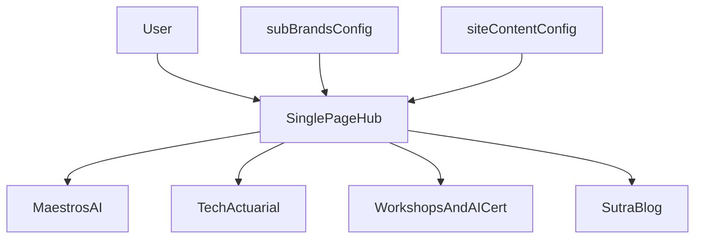

## High-level approach

- **Goal**: Create a single-page, modern, visually distinctive hub site that clearly explains the parent company and routes visitors to four sub-sites, with minimal ongoing maintenance.
- **Tech stack (concrete)**: Existing standalone Next.js App Router project (React, TypeScript) with Tailwind CSS plus shadcn UI as the primary component library, fully static (no backend), deployable to Vercel or similar.
- **Design direction**: Fresh visual identity crafted for this page—clean, editorial feel suitable for actuarial/insurance + AI, using a strong typographic hierarchy, asymmetric layout, subtle motion, and a bold but professional color palette.
- **Maintainability principle**: Centralize all sub-company data (names, taglines, descriptions, URLs, status flags) in a single configuration file so that updating links or copy only requires editing structured data, not layout code.

## Information architecture & layout

- **Top-level sections (single page)**
  - **Hero**: Parent company name, very clear one-line value proposition, and a short supporting sentence; prominent primary call-to-action buttons for each of the four sub-sites.
  - **Sub-company grid**: Four high-impact cards/tiles (Maestros AI, Tech Actuarial, Workshops & AI Certification, Sutra Blog) with description, key benefits, and "Visit" buttons that open the respective sites.
  - **Who this is for**: Short section outlining audiences (e.g. insurers, actuarial teams, professionals, learners) to ground the offerings.
  - **Capabilities / differentiators**: A concise list or visual row that explains how the four brands complement each other (e.g. innovation, traditional actuarial strength, education, thought leadership).
  - **Trust & signals** (optional early, can be phase 2): space for logos, testimonials, or stats when you have them.
  - **Footer**: Basic navigation (repeat links to four sub-sites), contact email / form link, legal links (privacy/terms placeholders).
- **Layout & UX patterns**
  - **Single-page scroll** with sticky minimal header that shrinks on scroll and keeps quick access to sub-site CTAs.
  - **Distinctive card layout** for sub-companies (not a generic grid): staggered heights, subtle overlaps, or diagonal section dividers to feel designed, not templated.
  - **Responsive-first**: Layouts for mobile, tablet, and desktop, ensuring the four sub-sites are easily tappable on small screens.
  - **Accessibility**: Semantic HTML for sections, headings, and buttons; focus states and sufficient contrast for all interactive elements.

## Visual design system

- **Branding & theme (for this page)**
  - **Color palette**: One main brand color (e.g. deep teal or rich indigo), a warm accent (e.g. amber for highlights), and a neutral background with subtle gradient/texture; all defined as CSS variables or Tailwind/shadcn theme tokens.
  - **Typography**: Distinctive display font for headings and a refined, readable sans-serif or serif for body text; set up responsive type scale tokens integrated with Tailwind and shadcn UI typography.
  - **Motion**: Staggered entrance animations for hero text and the four cards; gentle hover transitions on cards and buttons; minimal but meaningful.
  - **Backgrounds**: Use a composed background (gradient mesh, light geometric lines referencing data/actuarial grids) instead of a flat color.
- **Reusable components (built on shadcn UI)**
  - **Section wrapper**: Layout shell using Tailwind utilities, wrapping shadcn primitives where useful, with consistent max-width, padding, and optional background variants.
  - **BrandCard**: Composed from shadcn `Card`, `Button`, and `Badge` components for each sub-company (title, label, short description, 2–3 bullet keywords, CTA button, subtle icon/mark).
  - **Buttons**: Use shadcn `Button` variants (e.g. `default`, `outline`, `ghost`) for consistent CTAs and secondary actions.
  - **Tags/Chips**: Use shadcn `Badge` to label sub-companies (e.g. "AI & Agents", "Actuarial + Data Science").

## Data & configuration structure

- **Central config file**
  - Create a data module like `[project-root]/src/config/subBrands.ts` (or `lib/subBrands.ts`) exporting an array of objects, e.g.:
    - `id`, `name`, `slug`, `tagline`, `description`, `url`, `category`, `accentColor`, `status` (e.g. `"live"`, `"comingSoon"`).
  - Hero and meta content (page title, description, OG text) live in a separate config module so they can be updated without touching layout.
- **Usage pattern**
  - The hero section dynamically renders the four primary CTAs from this array.
  - The main sub-company grid maps over the same array, ensuring any future additions are automatically handled by layout.
  - Links and labels derive directly from config, making the single-page hub easy to maintain by editing one or two files.

## Implementation phases

### Phase 1 – Wire into existing Next.js + shadcn UI setup

- **1.1 Validate and align base setup**
  - Confirm the existing Next.js (App Router) + TypeScript + Tailwind project is configured as expected (including shadcn UI installation and base theme).
  - Tune `app/layout.tsx` with final font imports, global CSS, and metadata defaults in line with the hub’s visual direction.
- **1.2 Establish base page structure**
  - Implement the main entry page `app/page.tsx` with semantic sections for hero, sub-company cards, supporting copy, and footer, initially with minimal layout using Tailwind and shadcn layout primitives.
  - Ensure Tailwind config (font families, brand colors, spacing scale) and shadcn theme tokens are in sync.

### Phase 2 – Content model & maintainability layer

- **2.1 Define configuration modules**
  - Implement `subBrands` config array with the four entries:
    - **Maestros AI**: AI/agentic, non-traditional, future-looking insurance/actuarial solutions.
    - **Tech Actuarial**: Traditional actuarial services enhanced with data science.
    - **Workshops & AI Certification**: Professional workshops and training on AI in actuarial.
    - **Sutra Blog**: Blogs explaining complex topics simply but comprehensively.
  - Create a `siteContent` config object for hero copy, supporting messaging, and meta text.
- **2.2 Wire config into the page**
  - In `app/page.tsx`, consume the config to render hero CTAs and the sub-company grid.
  - Ensure that adding a fifth sub-company later only requires editing `subBrands` data and that the grid layout gracefully handles N items.

### Phase 3 – Visual design and components

- **3.1 Build core components**
  - Implement `Section`, `BrandCard`, `Button`, and `Tag` components in a `components/` folder.
  - Apply the new typography and spacing system; ensure consistent vertical rhythm and hierarchy.
- **3.2 Apply visual identity**
  - Design the hero section with bold but clean composition (e.g. large left-aligned headline, right side showing a subtle abstract visualization or summary of the four pillars).
  - Style the sub-company cards with asymmetric layout, distinct but cohesive accent colors, and hover states that clearly indicate interactivity.
  - Refine footer and header with minimal but polished styling (e.g. slim top bar with brand mark and quick links).

### Phase 4 – Motion, responsiveness, and polish

- **4.1 Motion & micro-interactions**
  - Add entrance animations for hero text and cards (using CSS transitions or a light animation library if needed) with staggered delays.
  - Implement hover and focus interactions for cards and CTAs (scale, shadow, accent border) tuned to feel professional, not gimmicky.
- **4.2 Responsive & accessibility pass**
  - Test and refine layouts across breakpoints: small mobile, large mobile, tablet, desktop, and large desktop.
  - Verify keyboard navigation, focus outlines, and color contrast; ensure that all external links are clearly indicated and open as desired (same tab vs new tab by design choice).

### Phase 5 – SEO, analytics, and production readiness

- **5.1 SEO & metadata**
  - Configure `metadata` in `app/layout.tsx` (or a dedicated metadata config) with a strong title, description, and Open Graph/Twitter tags.
  - Add structured data (JSON-LD) for organization and web site if desired.
- **5.2 Analytics & deployment**
  - Integrate lightweight analytics (e.g. Vercel Analytics or another provider) via dynamic import to avoid impacting performance.
  - Set up environment-specific configs (e.g. base URLs for sub-sites if they differ between staging and production).
  - Deploy to your chosen platform (e.g. Vercel) and verify performance metrics (LCP, CLS, TBT) are strong.

## Simple architecture diagram

## Implementation roadmap summary

- **Phase 1**: Set up a fresh standalone Next.js + styling stack and scaffold the main page/file structure.
- **Phase 2**: Create configuration-driven content (`subBrands`, `siteContent`) and wire it into a basic, working single-page layout.
- **Phase 3**: Implement polished, reusable components and apply a distinctive visual identity tailored to your brand context.
- **Phase 4**: Add motion, responsiveness, and accessibility refinements for a high-quality experience.
- **Phase 5**: Finalize SEO, analytics, and deployment, ensuring the hub is fast, discoverable, and easy to update.

